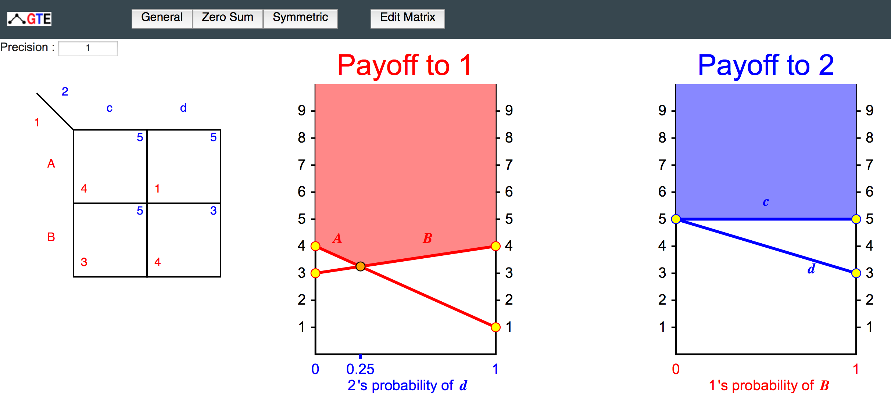
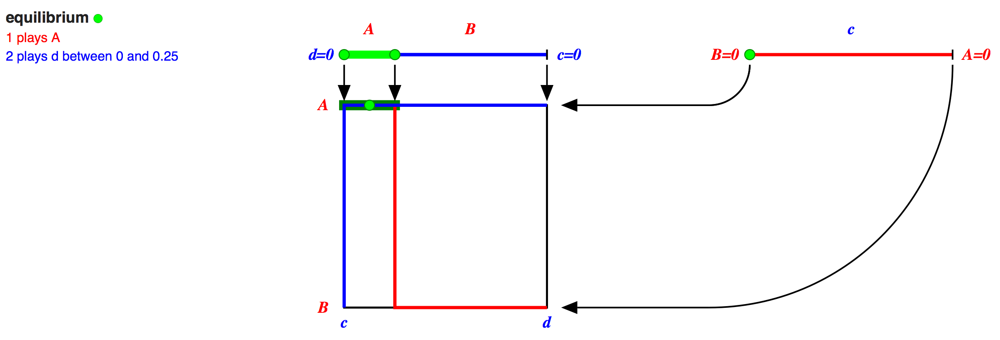
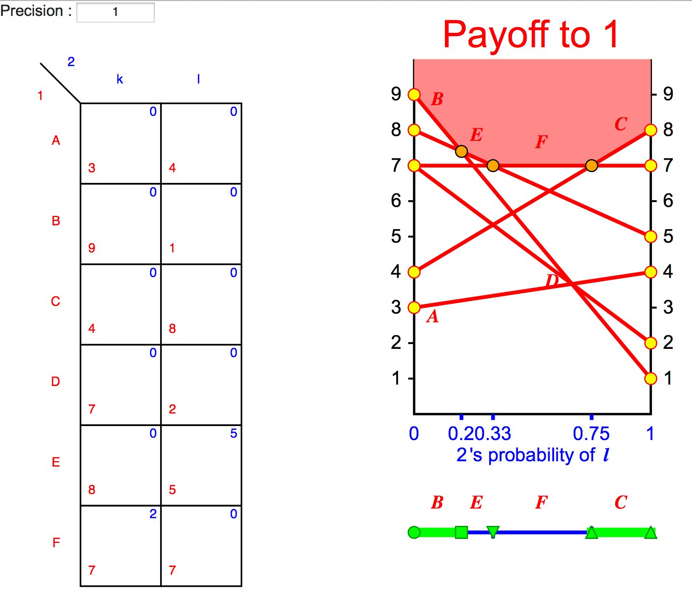
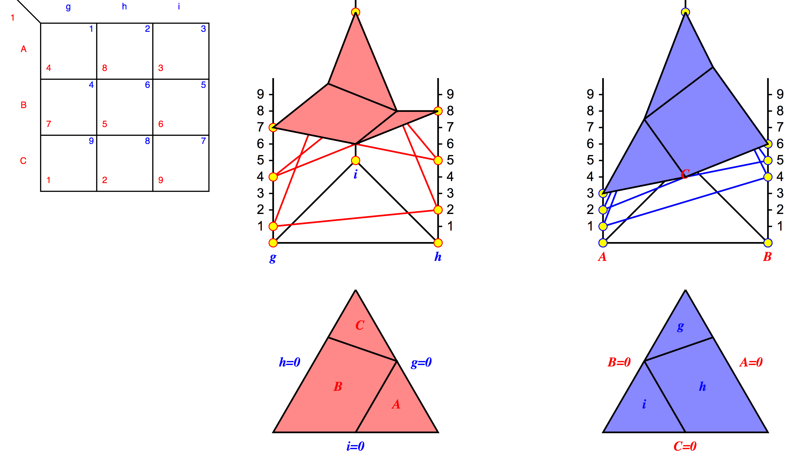
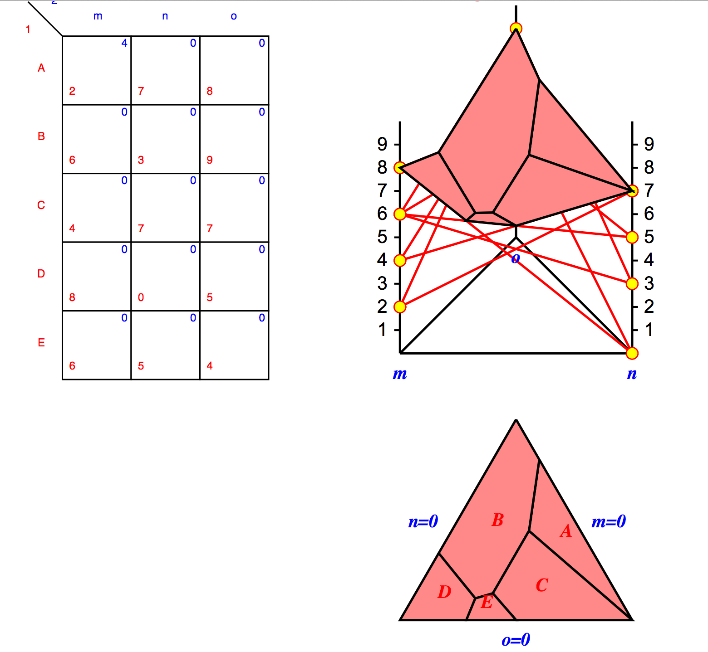

# Work by Amélie Heliou for GSoC 2016

I am a Google Summer of Code 2016 student for the project
Gambit - Software Tools for Game Theory.

My work is on the branch "eqdiagrams" in the project
repository JSGTE (JavaScript Game Theory Explorer), on 

https://github.com/gambitproject/jsgte/commits?author=amelieH

## Goal of the project

I implemented a display of best-response diagrams for small
two player games, which are intended for an understanding of
Nash equilibrium computation in education.
The goal is to create games interactively and display them
and their best-response structure on the screen.

The most detailed display is possible for 2x2 games where
both players have 2 strategies each. All mixed strategy
profiles and their best responses can then be represented on
a square. The best responses themselves are derived from
payoff diagrams above and point with arrows to the square.

This follows the specification at
https://github.com/gambitproject/jsgte/blob/master/INFOS/eqdiagrams.md

## How to start the program
The webpage can be load at http://gambitproject.github.io/jsgte/2byn.html

###Interactive display
There are four ways of specifying the payoffs of each players. I implemented 2 of them.
Payoff can be change by clicking on the "Edit matrix" button (not my implementation), by editing the matrix directly clicking on payoffs (not my implementation).
I implemented the interactive display of payoffs. The user can grab an endpoint or a line an move it up and down. The matrix is automatically updated.
I also added the precision input. The user can choose the precision of payoffs (1, 0.1 , ...).

###Features
* The two colored diagrams show (y-axis) the payoffs that each player receives according to the strategy they choose (line) and the mixture of strategies that the opponent choose (x-axis). The upper envelope shows the best-response of each player.

* Each diagram has a subdivided line below. This subdivided lines summarize the best-response choice.
* Square of equilibria, best responses of each player are link to form equilibrium. An equilibrium is defined by a symbol that also appears in the subdivided lines
* List of equilibria on the bottom right of the screen a list of all equlibria is displayed.

## Extension to mx2 games
The 2 by 2 game is extended by m by 2 games.
In this case, the payoffs of player 2 are not represented.
The display of player 1 can have as many lines (strategies) as wanted.

## Extension to game with 3 strategies
A 2D representation is not enought for games with 3 strategies.
Therefore I implemented a 2D projection of a 3D polyhedron.
The base is a triangle, each vertex of the triangle corresponds to a pure strategy. Each point of the triangle corresponds to a mixture of strategy.
This diagram is interactive too. The user can grab endpoint and move them up and down.
However she cannot do it with lines, as this diagrams can have confusing overlaps due to dimension.
Subdivided lines are changed by subdivided triangle which are the projection of the upper envelope into the plan (x0y).

Like for the 2 strategies representation, there is an extension when player 1 has more than 3 strategies.
When this occurs we cannot represent player 2's payoffs. We only display player 1 best reponses.

##Things to do next

* linked best response to equilibria for 3 by 3 and 3 by 2 games.
* Make a real 3D diagram with three.js
