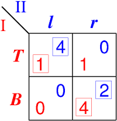
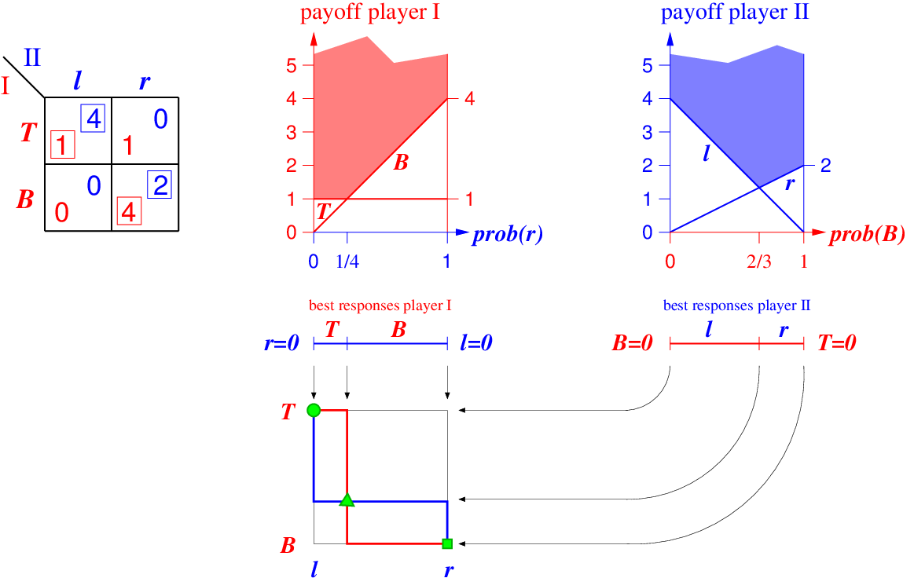
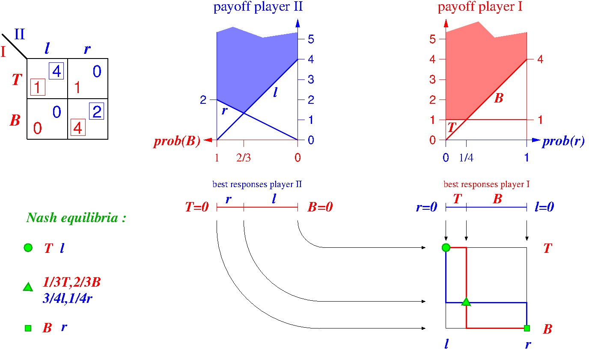

# Displaying equilibrium diagrams (Amelie)

## Overview

This work is on a separate webpage, later to be integrated
into GTE, to display best-response and equilibrium diagrams,
as outlined in the ideas list at
http://www.maths.lse.ac.uk/Personal/stengel/gsoc/#displaying-equilibrium-diagrams-for-learning-about-game-theory-algorithms 

It seems that a very good, compact, and universally used
package for manipulating webpages, and accessing the DOM
(Document Object Model, the data structure that defines a
webpage and its element which can be access in JS), is

    jQuery

which we will have to learn.

The webpage will display and allow editing a two-player game
in strategic form (which is the common part with GTE).

It will then draw graphics (such as upper envelope diagrams)
for best responses and equilibria depending on the payoffs,
and allow manipulation of the graphics that in turn change
the payoffs in the table. The type of graphics that can be
drawn depend on the number of strategies per player.

The graphics are similar to the Flash program at 
http://www.maths.lse.ac.uk/Personal/stengel/UpperEnv.swf
but the display of the game should be the same as in GTE.

Since we do not have a strategic-form display in JSGTE, this
is the first point we all have to agree on.

## Strategic form

The input for displaying equilibrium diagrams is a game in
strategic form.
The following is an example of BoS, the Battle of the Sexes,
game:

The standard information about this game is:

- player names, here I and II
- strategy names, here T and B for player I and l and r for
  player II
- payoffs, in red for player I and in blue for player II,
  in the shown corners of the four cells

Strategy names and player names should editable.
(Can at the beginning stay at the defaults used here,
because T and B and l and r and I and II are natural
choices.)

The **best response** payoffs are surrounded by **boxes**
which are to be computed automatically.

In a _degenerate game_, which in a 2x2 game means that a
pure strategy may have 2 best responses, there may be more
than one boxed red entry per column, or more than one boxed
blue entry per row.

(If a player has more than 2 strategies, the game is also
degenerate if his opponent mixes k strategies so that the
player himself has more than k pure best responses; for 2x2
games this can only happen for k=1 as just described.)

## Upper envelope diagrams

From this game we derive the upper envelope diagrams.
These can be drawn automatically from the payoffs.
Because this is a 2x2 game, the following pair of diagrams
is possible, which is the most elaborate and detailed of all.
(For larger strategy numbers, only more restrictive diagrams 
result, as will be explained.) 

See also the vector graphics (arbitrarily zoomable) file 
./EQDIAG/upperenv.pdf and the source file
./EQDIAG/upperenv.fig .

The two pictures on the right draw 

- the payoff to player I as a function of the _mixed strategy_ of player II, and
- the payoff to player II as a function of the _mixed strategy_ of player I

The first of these is easiest to understand:
The bottom line is the mixed strategy, given as the
probability prob(r) for playing the right strategy that goes
from 0 (left end of the interval) to 1 (right end of the
interval).

On each endpoint we erect a _goalpost_ that plots the
payoffs _to player I_ for the two possible responses of player I, namely

- strategy T, linear (here constant) payoff joining 1 on the left to 1 on the right
- strategy B, linear payoff joining 0 on the left to 4 on the right

The shaded set (here light) red gives payoffs that are _at
least_ as large as both these lines.
The set is "ragged" at the top to indicate that it goes off
to infinity.  
Perhaps a better (interactive) way (to be implemented later)
is to make the top a horizontal (rather than ragged) line
that can be interactively and continuously moved up and
down, filling the space below it in light red.

The blue set [0,1] of mixed strategies of player II is drawn
as a blue line again below this, which is subdivided into
two intervals, labeled T and B, that indicate the pure best
responses of player I. At the common point of these two
intervals, for prob(r)=1/4 (which depends on the payoffs to
player I), _both_ T and B are best responses. This means
player I can _mix_ between T and B at this point.

The right diagram is analogous, except that the horizontal
line now represent the mixed strategies of player I, drawn
as the probability prob(B) for playing B from 0 to 1.
The goalposts on the two ends denote the pure strategy T
(left end) and B (right end).

The upper envelope is then of the payoffs to player II,
drawn in blue, for the pure

- strategy l, a line that connects 4 to 0
- strategy r, a line that connects 0 to 2

At prob(B)=2/3, player II has both l and r as best
responses.

## Joint best response diagram for 2x2 games

This is shown at the bottom, where the set of all *pairs* of
mixed strategies is drawn as a square.
Clearly, the natural way to draw this is with the mixed
strategy of player II drawn horizontally (with the left end
of the horizontal dimension corresponding to strategy l, and
the right to strategy r), and the mixed strategy of player I
is drawn vertically, with T at the top and B at the bottom.

The possible best responses of player I can then be drawn as
a red solid line, here going from the top-left corner
horizontally at T (as the best response) until prob(r)=1/4,
for the particular mixed strategy prob(r)=1/4 then being a
*vertical line segment* because *any* mixed strategy of
player I is a best response, and then continuing as the
bottom horizontal line for prob(r) between 1/4 and 1.

This is also called the **best-response correspondence** of
player I, which is a correspondence and not a function
because player I sometimes has a whole set of best
responses.

The best-response correspondence of player II is similarly
drawn in blue, and derived from the best responses against
the mixed strategy of player I. For that purpose, the
subdivided interval for prob(B) between 0 and 1 is turned
vertically, by a clockwise quarter turn, as shown with the
quarter-circles that end in straight arrows that lead to the
square.

The *intersections of the best-response correspondence
curves* define the Nash equilibria (pairs of mutual best
responses), here three of them.
There will always be at least one such intersection.
In degenerate games, the mixed equilibrium may just be the
endpoint of a *whole interval* of equilibrium strategies.

#### Side note

This requires, in fact, that the upper envelope is of
payoffs to player II is drawn on the right (and not on the
left), i.e. as a second diagram, if the probability plotted
is that for the *second* strategy B of player II (which is
analagous to the second strategy r of player I in the left
diagram, and generally advisable).

If the best response of player II was drawn first, then one
could not simply use a quarter-turn to map the best response
to the side of the square, but would need a (confusing)
twist, or else draw the goal posts with B on the left and T
on the right.

Otherwise, the "mirror image" of the above diagram would
look like this. Clearly, it would be better to draw the
probability of T rather than of B from 0 to 1. 
The result would be less symmetric: normally we write 
1-p and p for two probabilities of given events, rather than
p and 1-p.  

Why is this worth a discussion?
It seems natural to draw the payoffs to player I first and
the payoffs to player II second, but in fact this is not the
natural choice. What is drawn in the earlier first picture is, in fact, the **set of
mixed strategies of player II** in the left diagram,
subdivided (via the upper envelope) into best responses of
player I, and here it seems better to draw this set of mixed
strategies of player I first.
However, when seeing this for the first time, "goalpost on
the left" should correspond to a "left" strategy, and
"goalpost on the right" to a "right" strategy, so one should
start this way.

## Interactive display

All these diagrams are a function of the payoffs.

As an educational tool, the dependency on these payoffs
should be demonstrated:

- change payoffs -> change diagram
- move upper envelope line -> change payoff entries.

So the main idea for interactivity is to be able to move the
endpoints of the payoff lines as in the Flash program.
This should be accompagnied by displaying the corresponding
change in the payoff matrix.

The possible endpoints of the line should **snap to a grid**
with the default being **integers only**. These integers are
marked at the left of the left pole.
To avoid clutter, the *right endpoint* of a payoff line is 
displayed only such as payoff 4 for the line for strategy B,
and not the other possibilities which are seen on the left.

At a later stage, the fineness of the grid should be
adjustable, e.g. to multiples of 0.5 or 0.1.

## Degenerate games

The following picture shows a _degenerate_ game.

In two-player games, a game is degenerate if some player has
a mixed strategy which assigns positive probability to _k_
pure strategies, against which the other player has _more
than k_ best responses.

Hence, a 2x2 game is degenerate if and only if there is a
pure strategy that has 2 best responses, like strategy _l_
in the above game. (This holds because the only case where
the definition of degeneracy can apply is when _k_=1).

A degenerate game can have an infinite number of Nash
equilibria. However, these will always be part of sets of
``interchangeable'' equilibria where it suffices to specify
the extreme points. In the above example, the two
best-response curves intersect in an interval where player II
play r for sure, and the two best responses T and B of
player I can now be mixed so that r stays a best response,
i.e. whenever $prob(B)\ge 2/3$.
