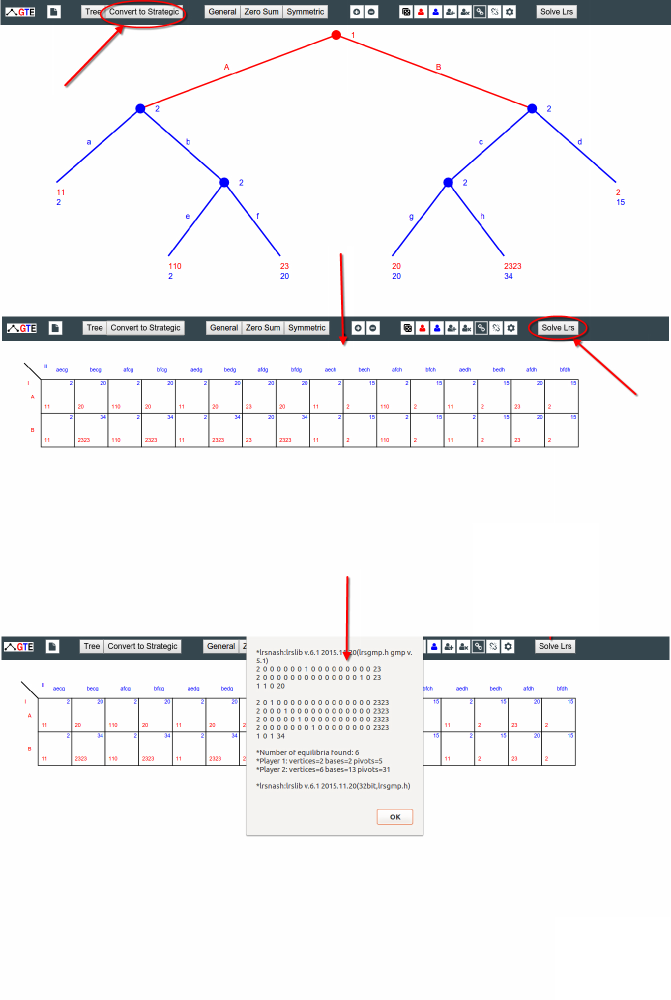
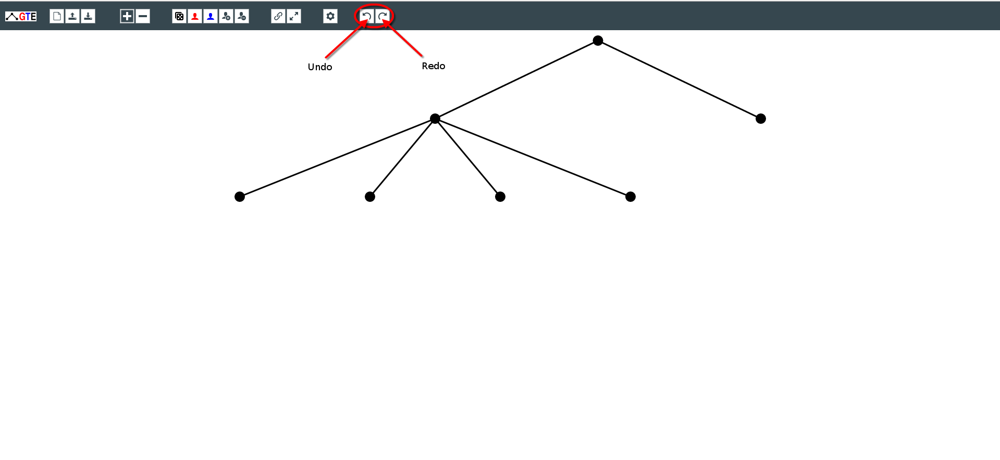

# This document outlines the changes made by [Harkirat Singh](//hkirat.github.io) to GTE during GSoC 2016.

Four Features were added during the duration of the program.

## 1. Converting tree games into strategic form games.

Previously in JSGTE, the only tree games were present and there was no option to convert tree games into strategic form. This feature implements the conversion of tree games into strategic form. It also lets the user create independent strategic form games without using trees.

## 2. Implementing server communication.

Previously in JSGTE, you could only create tree games. There was no functionality to solve that game. This feature implemented a node server which helps the user communicate with the algorithms that solve a particular game. Both strategic and tree games can be solved now.

Work on the first two features can be found here : https://github.com/gambitproject/jsgte/tree/strategic-form .

### This marks the work completed till the mid term evaluation.

## 3. Adding undo and redo feature to the tree games.

This feature involved adding undo and redo to events in JSGTE. Each button and unit click is considered as an undoable event. The global variables GTE.UNDOQUEUE and GTE.REDOQUEUE are used to access the list of events executed.

## 4. Adding functionality to load an xml tree game and export a game to xml format.

This feature allows the user to export a tree in xml format which can be later used to import the same tree in both JSGTE and GTE, the previous version of JSGTE.

[Tree in Xml](https://github.com/gambitproject/jsgte/blob/master/INFOS/images/tree-1.xml)

[Tree in Xml](https://github.com/gambitproject/jsgte/blob/master/INFOS/images/tree-2.xml)

Work on features three and four can be found in the undo-redo-load-save branch of the JSGTE repository. [Link](https://github.com/gambitproject/jsgte/tree/undo-redo-load-save).

A live demo of these changes can be found [here](//hkirat.github.io/jsgte/html).