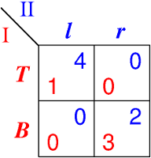
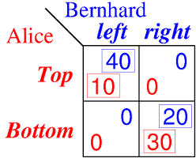
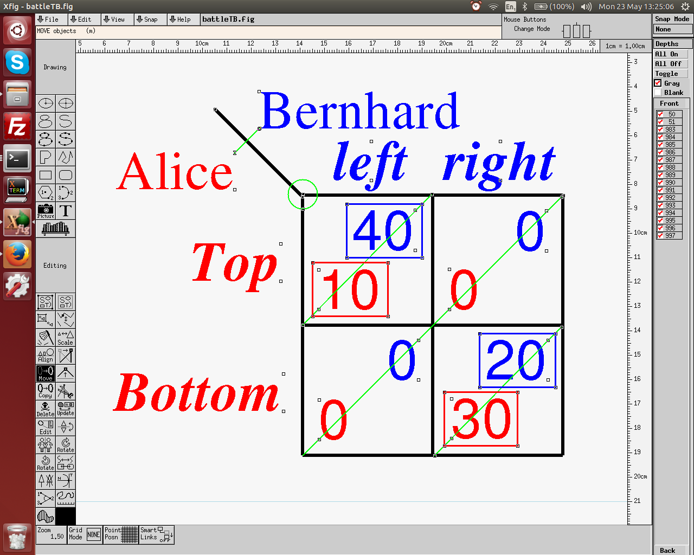
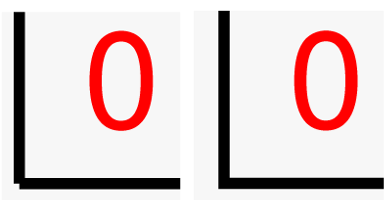

# Strategic form display and file format

Date: 23 May 2016

Part of this extends and re-uses material from
[INFOS/start_GSOC_2016.md](../INFOS/start_GSOC_2016.md).

## Terminology

The strategic form is one of the basic models of game
theory.

Another standard term is *normal form*.
Because "normal" is not a very descriptive word, leading
game theorists (such as Sergiu Hart, in the Handbook of Game
Theory that of which he co-edited the first three volumes
with Bob Aumann) strive to establish the term *strategic
form* instead, and we should do so too.
Hence, the shorthand SF suggests itself.

One of the problems is that SF is also a possible
abbreviation for the *sequence form* which is another,
different strategic description, which is derived from
the *extensive form* (a game tree). Unlike the strategic
form, the sequence form has the same size as the game tree.
The sequence form is very useful for solving game trees of
large (and even medium) size and we will use it.

So it seems that we have convenient abbreviations EF, NF, SF
for extensive form, normal form, and sequence form.
However, we should not re-introduce "normal form" for this
purpose only. In addition, the sequence form is not well
known, nor is the abbreviation "SF" for "sequence form".

I suggest the following alternatives (for discussion):

* EF for extensive form
* SF (or possibly STF) for strategic form (also known as normal form)
* QF (or possibly SQF) for the seQuence form

Further common abbreviations:

* NE for Nash equilibrium
* SPNE for subgame perfect Nash equilibrium.

## Definition

The SF (strategic form) is specified by a set of
N *players*, each of which has a nonempty set of
*strategies*, and *payoffs* defined for each player as
follows.
N is a positive integer.
A *strategy profile* is an N-tuple of strategies, one for
each player.
The SF specifies a payoff to each player for each strategy
profile.

In our computational setting, the sets of players and their
strategies are all finite, payoffs are rational numbers
(in the theory, real numbers).

The strategic form can be considered either as

* a primitive, that is, a given game structure on its own, or
* *derived* from an EF (extensive form) game.

EF games are often converted to SF in order to study
concepts like NE (Nash equilibrium), or to compute a NE.

### Names of strategies and players

In order to display a SF game, players and strategies should
have *names*.

In JS, these names could be used to index the N-dimensional
array that defines the SF.
However, the order of these names should not prescribe the
order in which they appear.
We will therefore *number* the strategies as nonnegative
integers (starting from 0), and keep their names separately.

Players should also have names.
We number players with 1, 2, 3 and so on.
Player 0 is the special *chance player* in an EF game.

## Two-player games

The following is an example of a two-player game, a version
of the "Battle of the Sexes" or BoS.

 

Player 1 (named I) chooses a row, and player 2 (named II)
chooses a column.
The strategies of player 1 are named T and B.
The strategies of player 2 are named l and r.
Each cell contains two payoffs, one for player 1 and one for
player 2.
The name of player 1, his strategies, and payoffs, are shown
in red (for "row player").
The name of player 2, her strategies, and payoffs, are shown
in blue.
(For two players we often use the two genders "he" and "she".)

This is the standard display of a two-player game.

### Displaying two-player games

We want to create displays that *look perfect* so that
people use them in their presentations.

We will also allow some customizations (e.g., fonts and
colors), but the default should already look very nice.

The next picture, although a bit crowded, shows the
following features which make the display at least not
messed up when there are long names for players and
strategies.

 

All cells are *square*.

*Player names* are shown next to a diagonal line of fixed
length, about 3/4 of the length of a cell diagonal.
(The length of this diagonal line should be configurable;
not everyone wants to have this line.)
The name of the row player is displayed *right-adjusted*.
The name of the column player is displayed
*left-adjusted*, and sufficiently *above* the names for
the column strategies.

In each cell, the payoffs are *left-adjusted* for player 1,
and *right-adjusted* for player 2.
The purpose is to make them look nice in the usual situation
when most payoffs are small integers.
We do *not* make the payoffs to player 1 right-adjusted
because if only a single payoff is rather wide, such as a
fraction like 5/12, then the others would be in a weird
position.

The *strategy names* are *right-adjusted* for player 1, and
*centered* for player 2.

It is (optionally) possible to put a *box* around each
payoff that is a *best response*, i.e. gives maximal payoff,
to the given strategy of the other player.
(This information can be automatically derived. They
identify pure-strategy NE as those cells where all payoffs
are surrounded by boxes.)
These boxes should not run into each other, i.e. payoffs be
sufficiently apart, when the payoffs are wide.

The next picture is taken from the `xfig` program which has
been used to generate these pictures.  
It displays (with small squares) the adjustment (left,
right, or centered) of the respective text.

Moreover, the lower left corner of each payoff to player 1 and the
upper right corner of each payoff to player 2 should sit on
the off-diagonal (from the lower left corner to the upper
right corner) of each cell. The same applies to the
best-response boxes.

 

When drawing these, a specific problem is that the upper
right corner of a textbox cannot normally be described, but
has to be COMPUTED from the current font size (which should
give the height in pints). We should provide for this, and
not assume a fixed font size.

This picture shows also, with a green circle, the
*top left corner* of the main rectangle of the strategic
form, where also the diagonal line starts. 
This point should have graphic coordinates (0,0) against
which all drawing commands of lines should be computed.

The *grid* of cells should be drawn with as a *closed
rectangle* around the entire strategic form (which, in
theory, could have its own width).
The next picture shows what goes wrong when the grid is just
drawn with independet parallel horizontal and vertical lines
- the corner will show a little dent (left) which does not
occur when drawing a rectangle (right).

 

Suggestion: draw the outer retangle separate, with its own
line width, and the separating parallel inner lines 
independently (which may possibly have a different line
width, default same as outer rectangle).  

### Fonts

There should be a standard font *size* that makes single-digit
payoffs look nice and balanced (see above pictures).
A simple remedy to adjust overcrowded cells is to only
change the *cell size* but leave the font size alone.

As *typefaces* I have chosen above, and think it looks good:

* Helvetica (sans serif) for payoffs
* Roman (serif) for player names
* Roman bold italic (alternative: italic) for strategy
  names.

Making these at some time choosable is a future feature.

## More than two players

2 players:

* player 1 - rows
* player 2 - columns

3 players:
as many PANELS has player 3 has strategies

* player 1 - rows
* player 2 - columns
* player 3 - panels

The panels should normally be displayed horizontally.

Strategy names, per default:

* player 1 - upper case
* player 2 - lower case
* player 3 - upper case

standard strategy names:

* player 1 - two strategies: T,B; three strategies: T,M,B;
  four more strategies: A,B,C,D etc.
* player 2 - two strategies: l,r; three strategies: l,c,r
  four more strategies: a,b,c,d etc.
* player 3 - if panels displayed horizontally:
  two strategies: L,R; three strategies: L,C,R
  if panels displayed vertically, or perhaps already
  generally, for any number of strategies:
  P,Q,R,S,T... (which conflicts least with the above).

(not complete)

The strategic form is a table that lists STRATEGIES for each
player (rows for player 1, columns for player 2) and the
payoff to each player in the resulting cell.

For 3 players, there will be an additional choice of PANELS
for player 3, and each cell has 3 payoffs.

For 4 players, there will be rows of PANELS for player 3 and
columns of PANELS for player 4, and each cell has 4 payoffs.
While we will probably not use them, the potential
generality should be kept in mind.
E.g. we should not hardwire "2 players" into the payoff
vectors.

**IMPORTANT**:
The strategic form is DERIVED from the game tree, and
alternatively can be CREATED separately.

At the moment, there is no strategic form at all.

A basic solver for strategic-form games (which for two
players are called *bimatrix games*) is at 
http://banach.lse.ac.uk

The strategic form is also the basis for the display of
equilibrium diagrams (for Amelie).

We have to get basic input of strategic form games going
quickly. 
The display should be done as in GTE (which looks nice)
and is not too hard.
Game matrices can be input with input boxes.

Issue 3:

WYSIWIG input by with TAB and RETURN keys as in
spreadsheets.

Issue 4:

Creation of the set of STRATEGIES from the extensive form.
A strategies specifies a move for EVERY information set of
the player. When the info set cannot be reached due to an
OWN earlier move, then the move is left blank (or
represented with a "*"; display should be configurable).
The natural order of strategies requires an order, typically
breadth-first of the info sets of the player, because that
is the order in which the moves appear in the strategy.
Move names (such as "L" and "R") are allowed to appear for
different nodes, but are identified by their respective
info set; that correspondence must be clear.

The strategic form should appear on a separate canvas.
It would be nice if this appears (in small) next to the game
tree, or in a separate popup window (configurable? later)
while the game tree is created.
Changing a payoff will the immediately result in changes in
the strategic form (typically in more than one place as the
strategic form is rather redundant in that respect, much
more cells than game tree leaves).

Design requirement:

make top left corner of strategic form diagram (= endpoint
of diagonal separator) reference coordinate (0,0) like in
bimatrixgame.sty

